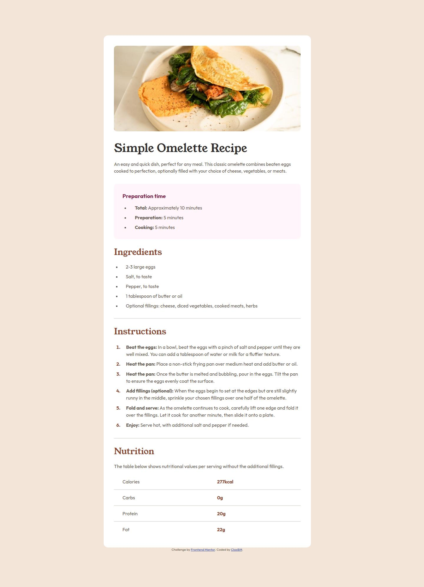

# Frontend Mentor - Recipe page solution

This is a solution to the [Recipe page challenge on Frontend Mentor](https://www.frontendmentor.io/challenges/recipe-page-KiTsR8QQKm). Frontend Mentor challenges help you improve your coding skills by building realistic projects.

## Table of contents

- [Overview](#overview)
  - [Screenshot](#screenshot)
  - [Links](#links)
- [My process](#my-process)
  - [Built with](#built-with)
  - [What I learned](#what-i-learned)
  - [Continued development](#continued-development)
  - [Useful resources](#useful-resources)
- [Author](#author)

## Overview

### Screenshot

### Links

- Solution URL: [Github](https://github.com/ClaxBitt/recipe-page)
- Live Site URL: [Netlify](https://recipe-main001.netlify.app/)

## My process

### Built with

- Semantic HTML5 markup
- CSS custom properties
- Flexbox

### What I learned

I learned about the relative measures `em` and `rem` and how these measures are important for responsive design.

### Continued development

I want to focus on the management of relative measures

### Useful resources

- [HTML Tables](https://www.w3schools.com/html/html_tables.asp) - It helped me to learn about HTML tables

## Author

- Frontend Mentor - [@ClaxBitt](https://www.frontendmentor.io/profile/ClaxBitt)
